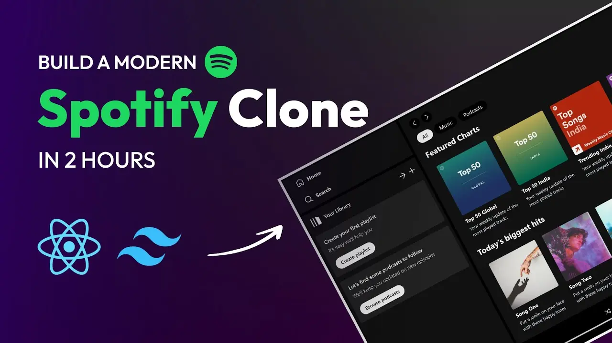

<div align="center">

# 🎵 Spotify Clone



<br>

### A modern Spotify-inspired music streaming web application built with React + Vite

<p>


</p>

<p>


</p>

<h3>
🚀
<a href="https://spotify-clone-one-kohl.vercel.app/" target="_blank">
Live Demo
</a>
</h3>

</div>

---

# 📖 About

Spotify Clone is a modern music streaming web application inspired by Spotify.

It recreates Spotify's elegant design while providing a smooth and responsive user experience built with React, Vite, Tailwind CSS and JavaScript.

---

# ✨ Features

- 🎵 Spotify-inspired UI
- 🔍 Music Search
- ❤️ Favorite Songs
- 📀 Albums & Playlists
- 🎧 Music Player
- 🌙 Dark Theme
- 📱 Fully Responsive
- ⚡ Fast Performance
- 📦 Progressive Web App (PWA)

---

# 🛠 Tech Stack

- React
- Vite
- JavaScript
- Tailwind CSS
- HTML5
- CSS3
- PWA

---

# 🚀 Installation

```bash
git clone https://github.com/Kamron5505/Spotify-clone.git

cd Spotify-clone

npm install

npm run dev
```

---

# 📂 Project Structure

```text
Spotify-clone
│
├── assets
│   └── cover.png
│
├── public
├── src
├── service-worker.js
├── package.json
├── vite.config.js
└── README.md
```

---

# 🌍 Live Demo

https://spotify-clone-one-kohl.vercel.app/

---

# 👨‍💻 Author

### Kamron Fazilov

Frontend Developer

GitHub:
https://github.com/Kamron5505

---

<div align="center">

### ⭐ If you like this project, give it a Star!

Made with ❤️ using React & Vite

</div>
